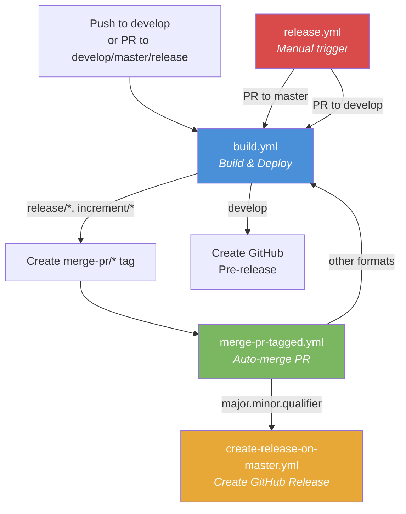
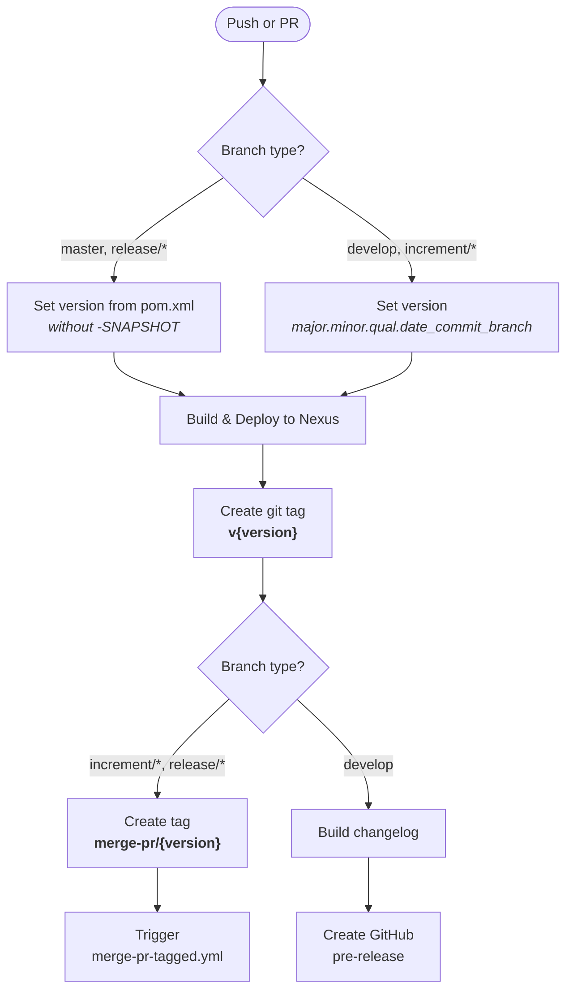
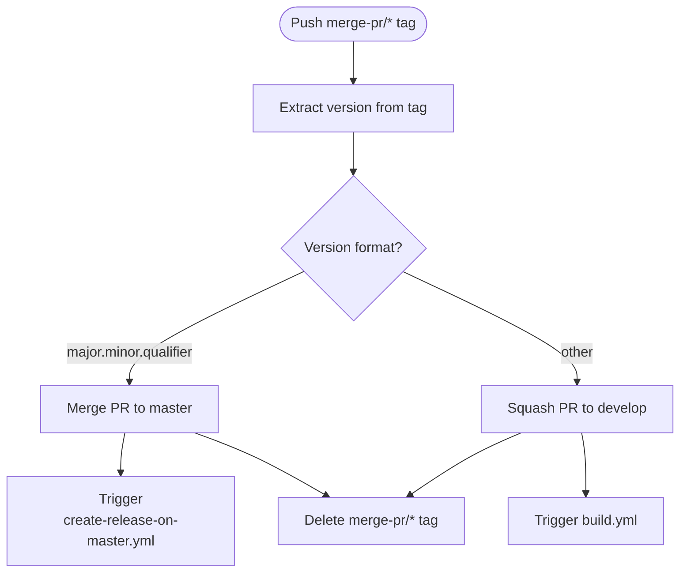
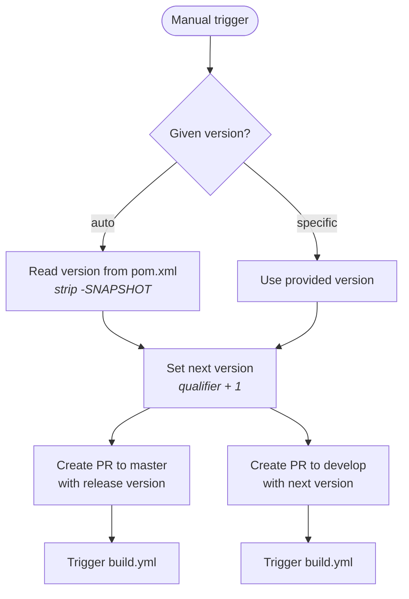

# CI/CD Flow: Development Versions and Branch Handling

This document describes the Git branching strategy and CI/CD pipeline for the judo-genmodel-generator project. The workflow is based on [GitFlow](https://www.atlassian.com/git/tutorials/comparing-workflows/gitflow-workflow) with automated CI pipelines on GitHub Actions.

## Branch Strategy

The project uses a GitFlow-based branching model where each branch type has a specific purpose and lifecycle.

```mermaid
gitDiagram
    commit id: "init"
    branch develop
    checkout develop
    commit id: "dev-1"
    branch feature/JNG-1
    commit id: "feat-1"
    commit id: "feat-2"
    checkout develop
    merge feature/JNG-1 id: "merge-feat"
    commit id: "dev-2"
    branch release/1.0-beta1
    commit id: "rc-1"
    branch bugfix/JNG-4
    commit id: "fix-1"
    checkout release/1.0-beta1
    merge bugfix/JNG-4 id: "merge-fix"
    checkout main
    merge release/1.0-beta1 id: "v1.0"
    checkout develop
    merge release/1.0-beta1 id: "back-merge"
```

### Branch Types

| Branch Pattern | Based On | Purpose | Merges Into |
|---------------|----------|---------|-------------|
| `develop` | — | Main development branch; contains the latest development sources of the active version | — |
| `feature/JNG-XXX_summary` | `develop` | New features for the next release | `develop` |
| `release/X.Y-betaN` | `develop` | Release candidate stabilization and testing | `master` + `develop` |
| `bugfix/JNG-XXX_summary` | `release/*` | Fixes found during release testing | `release/*` |
| `support/JNG-XXX_summary` | `release/*` | Minor changes for a previous release | `release/*` |
| `hotfix/JNG-XXX_summary` | `master` | Critical fixes for production | `master` + `develop` |
| `master` | — | Contains the latest released sources | — |

## Version Numbering

Version numbers follow semantic versioning with these rules:

| Event | Version Change | Example |
|-------|---------------|---------|
| Start a `feature/` branch | No change | stays at `1.1.2-SNAPSHOT` |
| Start a `release/` branch | 2nd number incremented on `develop` | `1.2.0-SNAPSHOT` |
| Start a `bugfix/` branch | No change | inherits release version |
| Start a `support/` branch | 3rd number incremented | `1.0.1-SNAPSHOT` |
| Start a `hotfix/` branch | 4th number incremented | `1.0.0.1-SNAPSHOT` |

### Build Version Format

- **develop / feature branches:** `major.minor.qualifier.yyyyMMdd_HHmmss_commitId_branchName`
- **master / release branches:** `major.minor.qualifier` (clean version from `pom.xml` without `-SNAPSHOT`)

## GitHub Actions Workflows

The CI/CD pipeline consists of several interconnected GitHub Actions workflows that automate building, merging, and releasing.

### Pipeline Overview



### build.yml

Triggers on push to `develop`, pull requests to `develop`/`master`/`increment/*`/`release/*`, or manual dispatch.



### merge-pr-tagged.yml

Triggers on push of `merge-pr/*` tags. Handles automatic PR merging based on version format.



### create-release-on-master.yml

Triggers on push to `master`. Creates the final GitHub Release with a generated changelog.

### release.yml

Manually triggered with a version parameter (either `auto` or a specific `major.minor.qualifier`).



## Development Rules

> **Important:** There is no commit without a ticket number. Every commit and pull request must reference a JIRA ticket in the format `JNG-xxx`.

Issue tracking is managed via [JIRA](https://blackbelt.atlassian.net/jira/dashboards).
