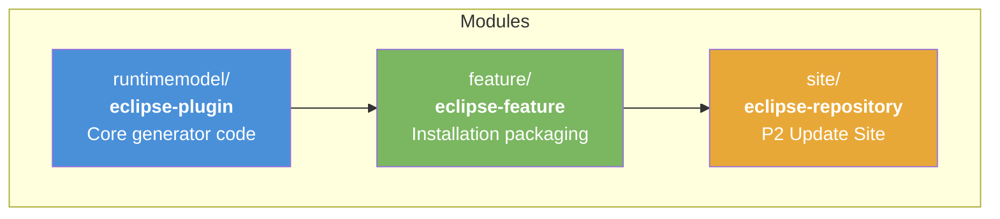
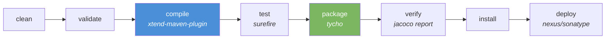

# Contributing to judo-genmodel-generator

Thank you for your interest in contributing! This guide covers everything you need to set up your development environment, understand the project structure, and submit changes.

## Development Environment Setup

### Required Tools

| Tool | Version | Notes |
|------|---------|-------|
| JDK | 21 | [Azul Zulu](https://www.azul.com/downloads/?version=java-21-lts&package=jdk) recommended |
| Maven | 3.9.4+ | Provided via `./mvnw` wrapper — no separate install needed |

### Verify Your Setup

Check Java:

```bash
java -version
# Expected: openjdk version "21.x.x" ...
```

Check Maven (via wrapper):

```bash
./mvnw -version
# Expected: Apache Maven 3.9.4 ...
```

## Project Structure

This is a multi-module Maven project built with [Tycho](https://github.com/eclipse-tycho/tycho) for Eclipse PDE. The source layout follows Eclipse plugin conventions rather than the standard `src/main/java` layout.



| Module | What it contains |
|--------|-----------------|
| `runtimemodel/` | All source code: Xtend templates that generate Java runtime model wrappers, MWE2 workflow configuration, and Guice DI bindings. Source lives in `runtimemodel/src/` (Eclipse PDE convention). |
| `feature/` | Eclipse Feature descriptor (`feature.xml`) — groups the plugin for installation. |
| `site/` | P2 Update Site (`category.xml`) — the deployable artifact that Eclipse IDEs consume. |

## Build Commands

```bash
# Full build
./mvnw clean install

# Tests only
./mvnw clean test

# Skip submodules (parent POM only)
./mvnw clean install -DskipModules=true
```

### Maven Profiles

| Profile | Purpose |
|---------|---------|
| `modules` | Active by default — includes runtimemodel, feature, and site modules. Deactivate with `-DskipModules=true`. |
| `sign-artifacts` | Signs artifacts for release distribution |
| `release-dummy` | Deploys to local `/tmp/` directory for testing |
| `release-judong` | Deploys to JudoNG Nexus repository |
| `release-central` | Deploys to Maven Central via Sonatype OSSRH |
| `generate-github-asciidoc-diagrams` | Generates PNG diagrams from AsciiDoc sources |
| `update-source-code-license` | Updates EPL-2.0 license headers in source files |

## Build Lifecycle



Key build plugins:
- **xtend-maven-plugin** (v2.39.0) — compiles `.xtend` source files to Java
- **tycho-maven-plugin** (v4.0.13) — drives the Eclipse/OSGi build
- **flatten-maven-plugin** — resolves CI-friendly `${revision}` version placeholders
- **jacoco-maven-plugin** (v0.8.12) — generates code coverage reports

## Submitting Issues

Before filing an issue, search the [issue tracker](https://github.com/BlackBeltTechnology/judo-genmodel-generator/issues) — your problem may already have been reported or resolved.

When filing a new issue, include:
- Output of `java -version` and `mvn -version`
- Your `pom.xml` or `.flattened-pom.xml` (if applicable)
- A minimal reproduction case that demonstrates the failure

A minimal reproduction helps maintainers confirm and fix the bug quickly. File new issues via the [issue form](https://github.com/BlackBeltTechnology/judo-genmodel-generator/issues/new/choose).

## Submitting Pull Requests

This project uses [GitHub's forking model](https://guides.github.com/activities/forking/). Fork the repository and submit pull requests from your fork.

For details on the CI/CD pipeline and how branches are managed, see the [CI Flow documentation](.github/CIFLOW.md).
