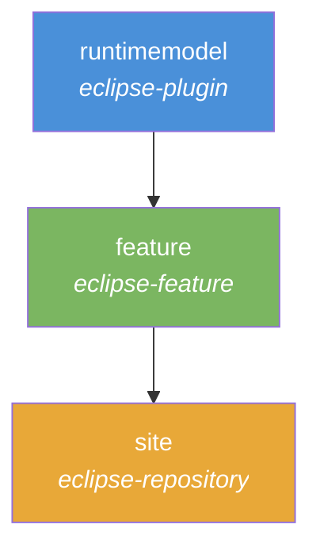
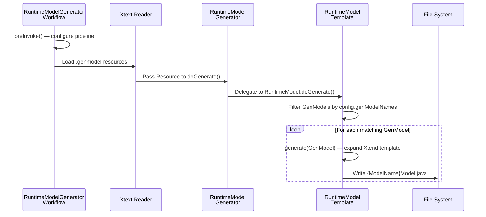
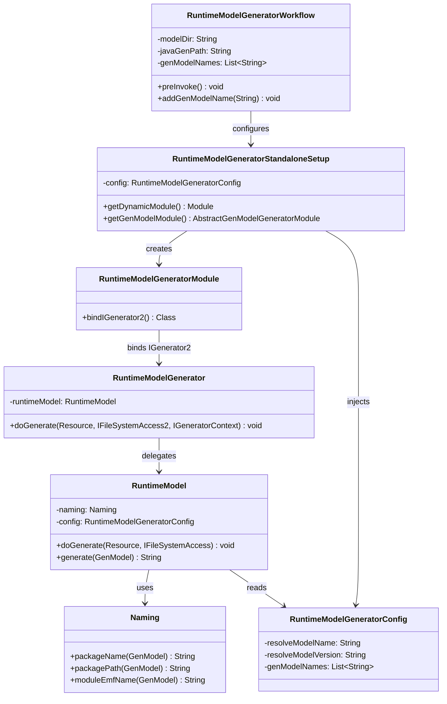
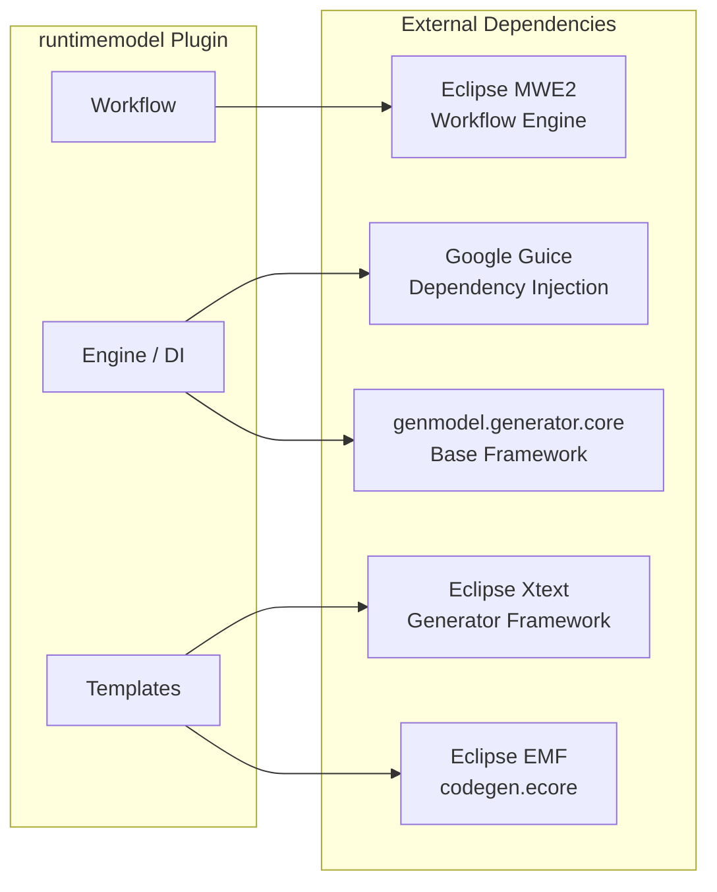

# JUDO GenModel Generator

[](https://github.com/BlackBeltTechnology/judo-genmodel-generator/actions/workflows/build.yml)

An Eclipse plugin that generates JUDO runtime helper classes for EMF (Eclipse Modeling Framework) GenModels. It produces type-safe model wrapper classes with builder patterns, load/save operations, validation, and OSGi support — so consumers of EMF models get a clean, fluent Java API instead of working directly with low-level EMF resources.

The plugin is distributed as an Eclipse Update Site for installation into Eclipse-based IDEs.

## Module Overview

The project is organized into three Maven modules, each serving a distinct role in the Eclipse plugin lifecycle:



| Module | Packaging | Purpose |
|--------|-----------|---------|
| `runtimemodel/` | `eclipse-plugin` | Core plugin containing all source code — Xtend code generation templates, MWE2 workflow orchestration, and Guice dependency injection configuration |
| `feature/` | `eclipse-feature` | Eclipse Feature descriptor that packages the plugin for installation |
| `site/` | `eclipse-repository` | P2 Update Site that aggregates features into a deployable repository |

## Architecture

The generator follows a pipeline architecture driven by the Eclipse MWE2 (Modeling Workflow Engine) and Xtext code generation framework.

### Code Generation Pipeline



### Component Relationships



### Generated Output Structure

For each GenModel processed, the template generates a `{ModelName}Model.java` file containing:

- **Model wrapper class** with fluent builder (`{ModelName}ModelBuilder`)
- **Load/Save argument classes** with their own builders (`LoadArguments`, `SaveArguments`)
- **Validation exception class** (`{ModelName}ValidationException`)
- **Diagnostic inspection methods** for model validation
- **EMF ResourceSet management** with optional URI handler configuration

### Dependency Graph



## Build Commands

> **Note:** Always use the Maven Wrapper (`./mvnw`) — it pins Maven 3.9.4 and is preconfigured with JVM arguments in `.mvn/jvm.config`.

```bash
# Full clean build (all modules)
./mvnw clean install

# Run tests only
./mvnw clean test

# Build without submodules (parent POM only)
./mvnw clean install -DskipModules=true
```

### Prerequisites

- **Java 21** JDK (the Tycho compiler targets Java 11 bytecode, but the build toolchain requires JDK 21)
- **Maven 3.9.4+** (provided via `./mvnw`)

## Contributing

Everyone is welcome to contribute! Please see [CONTRIBUTING.md](CONTRIBUTING.md) for development guidelines, submission process, and CI/CD workflow details.

## License

This project is licensed under the [Eclipse Public License 2.0](https://www.eclipse.org/org/documents/epl-2.0/EPL-2.0.txt).
